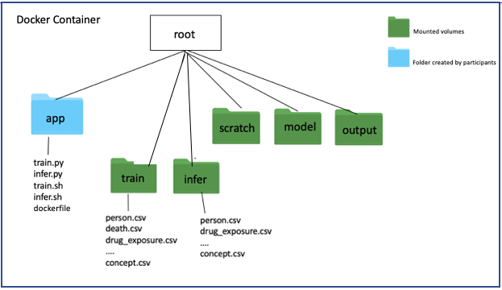

This is an instruction for building mortality prediction docker models for EHR DREAM Challenge. In this repository, a dockerised mortality prediction baseline model is used as an example and we will also provide instructions on how challenge participants can build up their own dockerised mortality prediction models.
# An example: a dockerised baseline model
This repository contains the code for building a baseline mortality prediction model which only uses patients' demographic information: age on cut-off date(July 5th 2017), gender and race.

To begin, clone the mortality_prediction_docker_model repository. Download omop synpuf data([Learn more about omop synpuf data](https://www.synapse.org/#!Synapse:syn18405992/wiki/589659)). Within the repository, create two folders called, "train" where the omop synpuf train dataset will live; "infer" where the omop synpuf infer dataset will live.

Change directory to "app" folder. Build a docker image basing on the dockerfile.
```
docker build -t baseline_model:v0.1  .

```
Run the train image
```
docker run -v<path to train folder>:/train:ro
-v<path to scratch folder>:/scratch:rw
-v<path to model folder>:/model:rw  baseline_model:v0.1 bash "/app/train.sh"
```
Run infer image
```
docker run -v<path to infer folder>:/infer:ro
-v<path to scratch folder>:/scratch:rw
-v<path to output folder>:/output:rw
-v<path to model folder>:/model:rw
baseline_model:v0.1 bash "/app/infer.sh"
```
If the docker model runs successfully, an "output.csv" file will be created in the output folder, which has two columns: one for person_id, the other for the 6-month mortality probability.
# Build your own docker model  
## Preparation
We suggest EHR DREAM challenge participants to prepare two scripts: train.py and infer.py.
train.py is for building a prediction model and infer.py is for generating predictions using the model; two bashfiles: train.sh and infer.sh for running train.py and infer.py.

*An example of bashfile is:*
```
#!/usr/bin/env bash

python /app/train.py

```
*notice:* participants can also name their scripts differently as train.py and infer.py, and can have multiple scripts for the training and predicting purposes, but they will need to specify in the train.sh which scripts to run for training models and in the infer.sh which scripts to run for generating predictions.

## Docker container structure

A docker container is built basing on the docker images submitted by participants. The illustration below shows the inside structure of a docker container.


"app" directory is created by participants in which scripts for building prediction models (train.py), generating predictions (infer.py) and bashfiles to run those scripts (train.sh and infer.sh) lie. Information to build "app" directory is in the dockerfile.

Other directories ("train","infer","scratch","model","output") will be mounted to the docker container by Synapse later. Participants don't need to create those directories but need to know the location of different directories in the container to access and store data.

Omop data inside "train" directory are provided to participants for building the models. Predictions are generated by applying models to omop data in the "infer" directory.  Omop data inside "train" and "infer" directories have the same tables and formats as synpuf data except there is no death.csv file  in "infer" directory.

*An example for transforming person.csv in "train" directory to a pandas dataframe in train.py*
```python
df = pd.read_csv("/omop/train/person.csv")
```

"scratch" directory is used to store intermediate files(e.g. selected features)

"model" directory is used to store the model.

"output" directory is used to store the prediction generated for the "infer" omop data.


## create a dockerfile

A dockerfile is required to build a docker image. A template for dockerfile is provided in this repo.


*specify environment*
```dockerfile
FROM python:3.5
```

*specify packages required for running the model*
```
RUN pip install pandas
RUN pip install numpy
RUN pip install sklearn
```

*make a directory called "app" and copy scripts and bash files for running scripts to this "app" directory*
```
RUN mkdir app
COPY ./train.py /app/
COPY ./infer.py /app/
COPY ./train.sh /app/
COPY ./infer.sh /app/
```

*set commmands for running bashfiles*
```
RUN chmod +X /app/train.sh
RUN chmod +X /app/infer.sh
```
## Create a docker image
Put dockerfile, train.sh, train.py, infer.sh, infer.py in the same direcotory and run the command below:
```
docker build -t  docker.synapse.org/syn12345/my-repo path/to/dockerfile
```
[Learn more about building docker images](https://docs.docker.com/get-started/)
## Submission to synapse platform
Log in Synapse
```
docker login -u <synapse username> -p <synapse password> docker.synapse.org
```
After logging in, view docker images and decide which ones to push into the registry.
```
docker images
#REPOSITORY                                 TAG                 IMAGE ID            CREATED             SIZE
#docker.synapse.org/syn12345/mytestrepo   version1            f8d79ba03c00        6 days ago          126.4 MB
#ubuntu                                     latest              f8d79ba03c00        6 days ago          126.4 MB
#docker.synapse.org/syn12345/my-repo	latest	df323sdf123d	2 days ago	200.3 MB
```
Push the docker image to Synapse platform.
```
docker push docker.synapse.org/syn12345/my-repo
```
[Learn more about submitting images to Synapse platform](https://docs.synapse.org/articles/docker.html)
